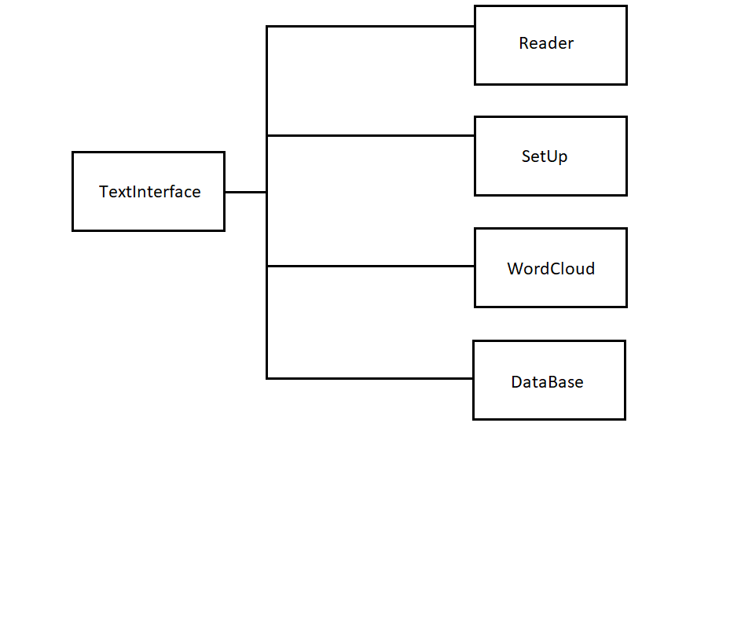
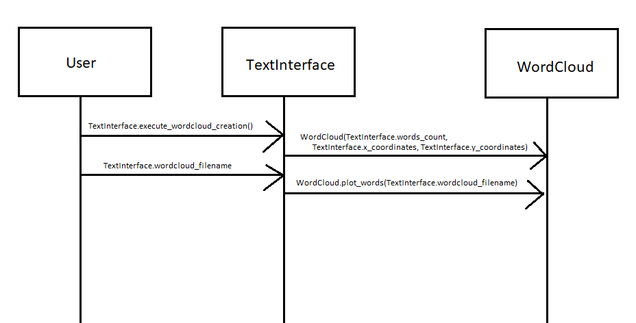

# Arkkitehtuurikuvaus

## Rakenne
Ohjelman rakenne: Moduuli *ui_text* sisältää tekstikäyttöliittymän toiminnallisuudet. Moduuli *reader* 
sisältää toiminnallisuudet tekstin lukemiseen tekstitiedostosta, *data_setup* tekstin valmisteluun 
sanapilveä varten, *wordcloud* sanapilven piirtämiseen ja tallentamiseen .png-tiedostona ja moduuli
*database* sanapilven tietojen tallentamiseen tietokantaan ja lukemiseen tietokannasta.

## Toiminnallisuudet

### Sanapilven luominen
Käyttäjä (User) tekee tekstikäyttöliittymän kautta luokan *TextInterface* metodilla 
*execute_wordcloud_creation()* luokasta *Wordcloud* olion syöttäen samalla tiedot x- ja y-koordinaateista
ja listan tekstidatasta. Tämän jälkeen luokan *TextInterface* muuttujaan *wordcloud_filename* tallennetaan
sanapilvelle annettava tiedostonimi. Sen jälkeen sanapilvi luodaan ja tallennetaan luokan *WordCloud*
metodilla *plot_words*.

